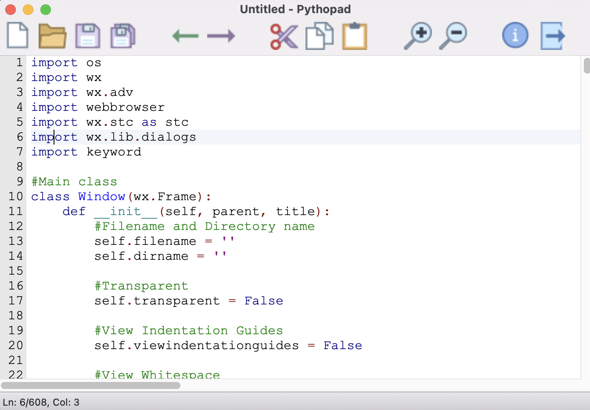

  

[Download Pythopad](https://a.fsdn.com/con/app/sf-download-button)](https://sourceforge.net/projects/pythopad/files/latest/download)
## Features
- Toolbar
- Wide array of view options
- Syntax highlighting support for Python
- Usable accelerator keys for each function (Ctrl+N, Ctrl+O, etc.)
- Zoom in and zoom out
- Newline ending

## Pythopad Release Information
- **Name:** Pythopad
- **Version:** 1.0
- **Author:** Mohamed Ahmed
- **Release Date:** 9/13/2021
