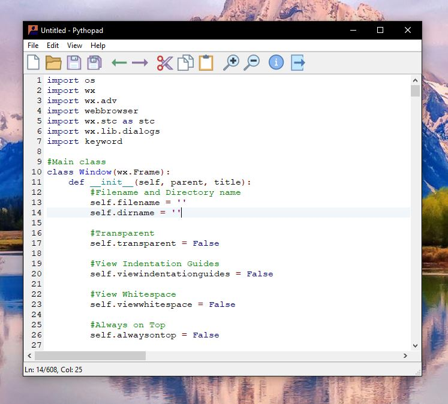

<h3 align="center">
  
</h3>

  
  
 

 

  
  
  

<h4 align="center">
  <a href="https://maltarawy.github.io/pythopad/" target="_blank">Website</a>
</h4>
<h4 align="center">
  <a href="http://sourceforge.net/projects/pythopad/files/latest/download" target="_blank">Download</a>
</h4>

  

## Features
- Toolbar
- Wide array of view options
- Syntax highlighting support for Python
- Usable accelerator keys for each function (Ctrl+N, Ctrl+O, etc.)
- Zoom in and zoom out
- Newline ending

## Pythopad Release Information
- **Name:** Pythopad
- **Version:** 1.0
- **Author:** Mohamed Ahmed
- **Release Date:** 9/13/2021
